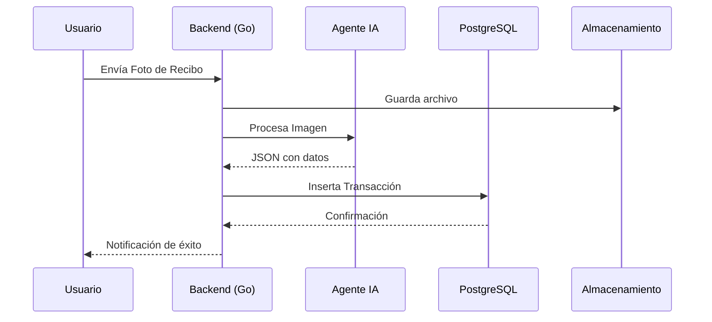
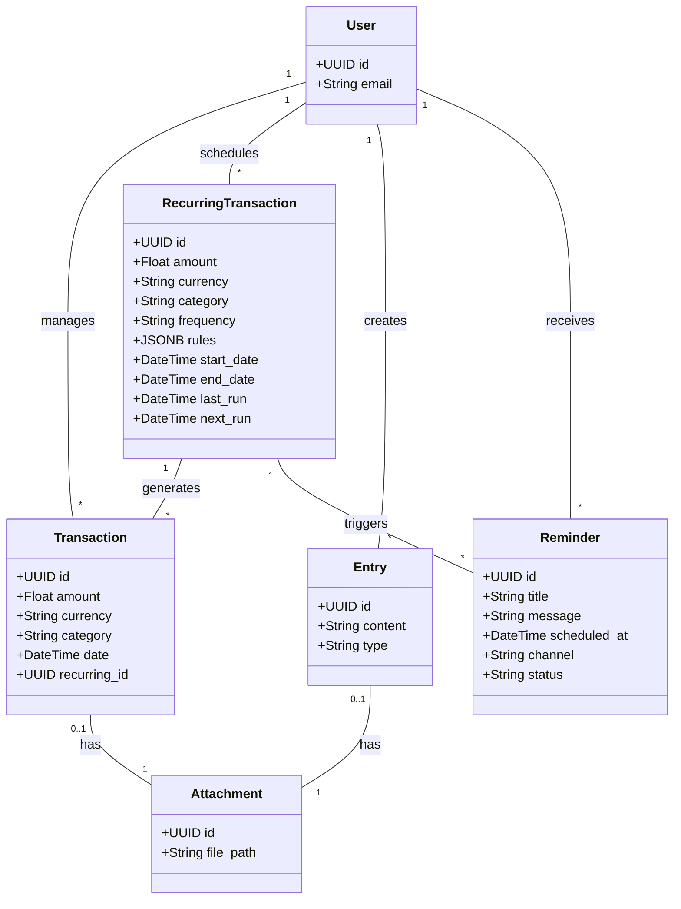

# Life Manager - Casos de Uso y Diagramas UML

## 1. Identificación de Actores
- **Usuario**: Persona que interactúa con el sistema para gestionar sus finanzas y vida personal.
- **Agente IA**: Entidad interna que procesa entradas multimodales (OCR, Transcripción, NLP).
- **Sistema de Almacenamiento**: Base de datos PostgreSQL y almacenamiento de archivos (S3/Local).
- **API de IA Externa**: Proveedor de modelos (OpenAI/Anthropic) para procesamiento avanzado.

## 2. Diagrama de Casos de Uso (Mermaid)

```mermaid
graph TD
    %% Actores
    U((Usuario))
    AI[Agente IA]
    S[(Sistema)]

    subgraph Gestion_Financiera [Gestión Financiera]
        UC1([Registrar Gasto/Ingreso])
        UC2([Subir Recibo/Factura])
        UC3([Consultar Reportes])
        UC4([Gestionar Activos])
        UC9([Programar Transacción Recurrente])
    end

    subgraph Organizacion_Personal [Organización Personal]
        UC5([Crear Nota/Diario])
        UC6([Programar Recordatorio])
    end

    subgraph Procesamiento [Procesamiento Inteligente]
        UC7([Categorización])
        UC8([Extracción OCR])
    end

    U --> UC1
    U --> UC2
    U --> UC3
    U --> UC4
    U --> UC5
    U --> UC6
    U --> UC9

    UC1 -.-> UC7
    UC2 -.-> UC8
    UC8 -.-> UC7
    UC9 -.-> UC7
    UC9 -.-> UC6 : include
    
    UC7 --- AI
    UC8 --- AI
    UC3 --- S
    UC4 --> S
    UC9 --> S
```

## 3. Diagrama de Secuencia: Registro Multimodal



## 4. Diagrama de Clases (Estructura de Datos)



---
*Documento actualizado el 2026-03-06*
