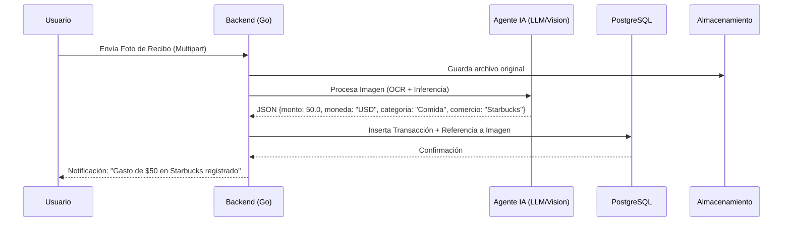
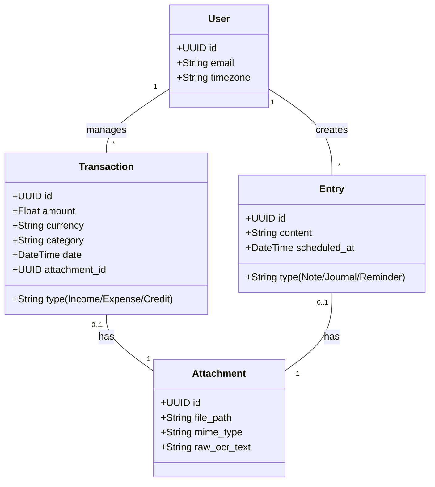

# Life Manager - Casos de Uso y Diagramas UML

## 1. Identificación de Actores
- **Usuario**: Persona que interactúa con el sistema para gestionar sus finanzas y vida personal.
- **Agente IA**: Entidad interna que procesa entradas multimodales (OCR, Transcripción, NLP).
- **Sistema de Almacenamiento**: Base de datos PostgreSQL y almacenamiento de archivos (S3/Local).
- **API de IA Externa**: Proveedor de modelos (OpenAI/Anthropic) para procesamiento avanzado.

## 2. Diagrama de Casos de Uso (Mermaid)

```mermaid
useCaseDiagram
    actor "Usuario" as U
    actor "Agente IA" as AI
    actor "Sistema" as S

    package "Gestión Financiera" {
        usecase "Registrar Gasto/Ingreso (Texto/Voz)" as UC1
        usecase "Subir Recibo/Factura (Imagen/PDF)" as UC2
        usecase "Consultar Reportes Financieros" as UC3
        usecase "Gestionar Activos y Pasivos" as UC4
    }

    package "Organización Personal" {
        usecase "Crear Nota o Diario" as UC5
        usecase "Programar Recordatorio" as UC6
    }

    package "Procesamiento Inteligente" {
        usecase "Inferencia de Datos (Categorización)" as UC7
        usecase "Extracción OCR/Transcripción" as UC8
    }

    U --> UC1
    U --> UC2
    U --> UC3
    U --> UC4
    U --> UC5
    U --> UC6

    UC1 ..> UC7 : <<include>>
    UC2 ..> UC8 : <<include>>
    UC8 ..> UC7 : <<include>>
    
    UC7 -- AI
    UC8 -- AI
    UC3 -- S
    UC4 -- S
```

## 3. Diagrama de Secuencia: Registro Multimodal
Este diagrama muestra el flujo desde que el usuario envía una foto de un recibo hasta que se guarda como transacción.



## 4. Diagrama de Clases (Estructura de Datos)



---
*Documento generado el 2026-03-06*
